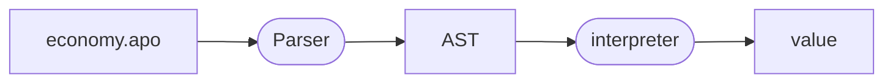

# Learn Functional Programming using ApoML

While developing ApoML you may learn a thing or two about
functional programming.

## Theory: Kotlin 101

This course is in Kotlin. We will quickly go over the basics of Kotlin
syntax to get you started. We assume familiarity with Java.

!!! tip "Kotlin resources"

    - [Kotlin Home](https://kotlinlang.org/)
    - [Kotlin Syntax](https://kotlinlang.org/docs/basic-syntax.html)
    - [Online Playground](https://play.kotlinlang.org/?_ga=2.246942342.320850194.1706268819-1134959140.1706268819)

## Theory: Functional Programming

Functional programming is often though of as a style of programming
with the emphasis on functions. I like to take a different perspective:
FP is a paradigm prioritizing functional correctness. To accomplish this,
we want a language and style of programming that makes it easy to reason
about programs.

[FP 101](./fp.md){ .md-button }

## Theory: Architecture of a Programming Language Implementation

The prototypical functional program is the implementation of
an interpreter for a programming language. Programming language
syntax is defined inductively. The inductive structure of the
model lends itself perfectly to a functional programming style.

In this theory lesson we look at the high-level design of a
programming language implementation. We will use it as a framework
for the hands-on lessons, but also as a useful functional architectural
pattern with its own merits.

We consider how this architecture applies not just to
language implementations, but to many design problems.

[PL 101](./pl.md){ .md-button }

The hands-on lessons each look at one of the components of the
language implementation in the diagram above. You can choose
to do any or all of the hands-on lessons independently.

## Hands-on: Functional Abstractions

In this hands-on lessons, we implement the _framework_ in which
we implement the parser for ApoML. The framework will demonstrate
a functional architecture for defining parsers. Characteristic
of functional architecture is the layering of abstractions, and
the emphasis on composition.

If you look closely at what we are doing, then you will see that
things look like 'turtles all the way down': on our way to
implementing a domain-specific language ApoML, we define
a domain-specific language for defining parsers...

## Hands-on: Parsing ApoML

In this hands-on lesson, we use the parser framework to define
the parser for ApoML.

## Hands-on: Abstracting over Effects

If you're used to imperative thinking, then it is easy to
jump to the conclusion that pure programming is great and all,
but clearly not applicable to most of your programming. After all,
your daily programming is all about having an effect on the outside world.
Impure by requirement!

In this hands-on lesson, we define a pure interpreter for ApoML
despite the fact that the language contains fundamentally
impure operations. We see that this yields highly reusable and
testable code. This shows that pure programming is not about
not performing effects, but about not performing those effects
'on the side'.

# Hands-on: Free electives ^^

If you feel like it, there are many exciting extensions to
be designed and implemented for ApoML.

- Adding new language constructs:
      * Booleans,
      * Functions,
      * Debugger.
- Adding a compiler.
- Compiling the interpreter to WASM and making an interpreter for the website.