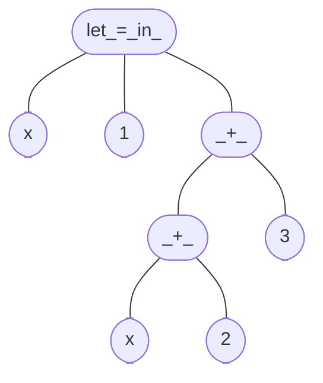
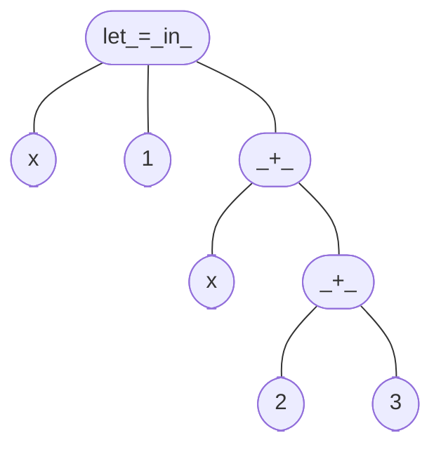
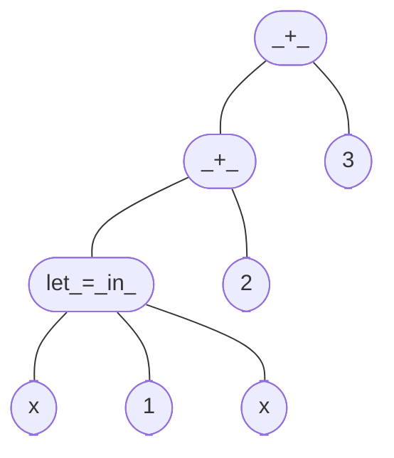

# Hands-on: Parsing ApoML

!!! Hint
    If you have not completed last day's parser combinator framework
    you can commit your work and move to the `course/day-2` branch
    to be able to move forward.

You made it here. Perhaps yesterday felt like a scene from Inception or Dr Strange:
a familiar city folding into unfamiliar shapes, abstractions all the way down.
Today we are going to start by exiting this nested fever dream and look at what we
have accomplished from the outside:

```kotlin title="parsec/parsec.kt"
fun <C, T> pure(v: T): Parsec<C, T>
fun <C, T> fail(msg: String): Parsec<C, T>
fun <C> match(pred: (C) -> Boolean, onErr: (C) -> String): Parsec<C, C>
fun <C> eos(): Parsec<C, Unit>
fun <C> readn(n: Int): Parsec<C, List<C>>
fun <C, T, S> Parsec<C, T>.map(f: (T) -> S): Parsec<C, S>
fun <C, T> Parsec<C, T>.mapError(onErr: (String) -> String): Parsec<C, T>
fun <C, T> Parsec<C,T>.filter(pred: (T) -> Boolean, onErr: (T) -> String): Parsec<C, T>
fun <C, T, S> Parsec<C,T>.flatMap(k: (T) -> Parsec<C, S>): Parsec<C, S>
infix fun <C,S,T> Parsec<C,S>.and(that: Parsec<C, T>): Parsec<C, Pair<S,T>>
fun <C,T> tryOrRewind(p: Parsec<C, T>): Parsec<C, T>
infix fun <C,T> Parsec<C,T>.or(that: Parsec<C, T>): Parsec<C, T>
fun <C,T> Parsec<C,T>.many(): Parsec<C, List<T>>
fun <C> exactly(tk: C): Parsec<C, C>
fun <C> exactly(tks: List<C>): Parsec<C, List<C>>
infix fun <C,S,T> Parsec<C,S>.skipAnd(that: Parsec<C, T>): Parsec<C, T>
infix fun <C,S,T> Parsec<C,S>.andSkip(that: Parsec<C, T>): Parsec<C, S>
fun <C,T> Parsec<C, T>.plus(): Parsec<C, Pair<T, List<T>>>
fun <C,T> choice(parsers: List<Parsec<C, T>>, onErr: String = "No match"): Parsec<C, T>
fun <C,T> choice(vararg parsers: Parsec<C, T>, onErr: String = "No match"): Parsec<C, T>
val <C,T> Parsec<C, T>.optional get(): Parsec<C, Option<T>>
```

This is what we have built: a ton of tiny state machines.
Each of these parser primitives has some complexity, but they are small enough that their implementation
can reasonably be verified by inspection.

Moreover, their types are super informative. If you consider that these are functional operators,
that cannot just conjure up values out of thin air, then there are only so many things that
they can do to produce the values that they return.

Today we will built the parser for ApoML expressions with the following type:

```kotlin title="apoml/parser.kt"
val exp: Parsec<Char, ApoExp> = TODO()
```

Unlike yesterday, however, we are not going to implement this by manually defining a new parser primitives
that deals with streams and results. We are going to built it compositionally from the primitive parsers.
We have some small examples like that already yesterday. For example:

```kotlin
/**
 * Parse exactly the provided list of inputs.
 */
fun <C> exactly(tks: List<C>): Parsec<C, List<C>> = readn<C>(tks.size)
    .mapError { "Expected $tks, but stream ended prematurely."}
    .filter({ it == tks }) { "Expected $tks, but got $it" }

/**
 * Parser that sequences [this] [and] [that] but only keep the result of [that].
 */
infix fun <C,S,T> Parsec<C,S>.skipAnd(that: Parsec<C, T>): Parsec<C, T> =
    (this and that)
        .map { it.second }
```

In those definitions we have moved away from the implementation details of
handling streams and results. We should try to get comfortable with that level
of abstraction: trust that our combinators allow you to step away from those details
and do not poke through the abstraction boundary when you reason about the program
all the time. This will be the key to building the next big thing on top of this.

!!! question
    Because we like composition, we work the problem bottom-up.
    Define parsers for the non-recursive ApoML expressions: 
    variables, int literals and the input operator `?` and `?(i, j)`.

## Ambiguities in Grammars

Consider the following ApoML expression:

```ocaml
let x = 1 in x + 2 + 3
```

The parser for ApoML needs to turn this into an 'abstract syntax tree';
an instance of `ApoExp`. It is not entirely obvious however which tree
this should produce. Among the reasonable trees one could imagine are:



Where we effectively disambiguated as `let x = 1 in ((x + 2) + 3)`.



Where we effectively disambiguated as `let x = 1 in (x + (2 + 3))`.



Where we effectively disambiguated as `((let x = 1 in x) + 2) + 3`.

In other words: the textual representation is more ambiguous than the model.
Hence, the parser needs to do the work of disambiguating.

In the specification of the language this is usually done by saying things like:

- `+` and `*` are left-associative: `x + y + z` is parsed as `(x + y) + z`.
- `+` binds more strongly than `let`: `let x = e1 in e2 + e3` is parsed as `let x = e1 in (e2 + e3)`.

!!! question
    These two rules rule out all but one of the possible parse trees for the example expression.
    Which tree is the tree that satisfies these disambiguation rules?

When we implement the parser we have to encode these rules.
We can do that by transforming the grammar to make the disambiguation evident.

## The Curse of Left Recursion

Consider the following grammar of additions

```bnf
integers i, j = 0, 1, 2, ...
addition e   := e + e
              | i
```

This grammar is 'left recursive', because we encounter `e` recursively first in the `+`
case.

It is tempting to write a nicely recursive parser for this language, like so:

```kotlin
fun addition(): Parsec<Char, Addition> = 
    ((addition() and exactly('+') and addition()) 
     or intlit)
```

so that the structure of the parser exactly mirrors the structure of the grammar.

Unfortunately this won't work! For two reasons.

The first reason is that as soon as we try to call this parser factory,
it will eagerly construct the recursive addition parsers and immediately stack-overflow.
The solution for this is to not eagerly construct the sub-parsers, but to wait until
we actually want to use that sub-parser to construct it. We have a utility `rec { _ }`
to do exactly that. This will give:

```kotlin
fun addition(): Parsec<Char, Addition> = 
    ((rec { addition() } and exactly('+') and rec { addition() }) 
     or intlit)
```

We can now successfully construct the parser, but it will still overflow when we run it.
The `or` parser combinator will first attempt to apply its first parser operand to the input. 
The first operand is a sequence of three parsers which will start running its first operand `rec { addition() }`. 
But we haven't consumed any input yet, so we are back where we started.
This will continue until we run out of stack space.

This means that we also have to be careful to write our parser in a way
that we always consume some input before we recurse.

## Disambiguating and Eliminating the Left Recursion

The trick to accomplish both is to refactor our grammar a bit to eliminate
the left recursion, and to make the disambiguation explicit.

For our simple example the left recursion is eliminated by rewriting---with
a slight abuse of notation---like so
       
```bnf
integers i, j  = 0, 1, 2, ...
addition e    := i + i (+ i)*
               | i
```

!!! question
    Check for yourself that this grammar is equivalent to the previous one,
    in the sense that every sentence that has at least one tree with previous (ambiguous)
    grammar, has at least one parse tree with this grammar.

Where `(+ i)*` denotes that we can parse `+ i` many more times.
The operands of a plus are now expressions consisting of operations that bind more
strongly than `+` itself. In the case of additions that is just `i`.
(For ApoML this will be a larger subset of expressions, including for example multiplications!)
Effectively, we now no longer have the option of parsing an addition as the operand of an addition.
Hence, we eliminated the left recursion. 

The trees that we now produce are not ambiguous: there is only one way to
parse `1 + 2 + 3`.
(At the same time, the tree model is not nicely
left-associative. Hence, we have to make sure that we transform the model that
comes out of the parser for this grammar to get the correct left-associative model.)

