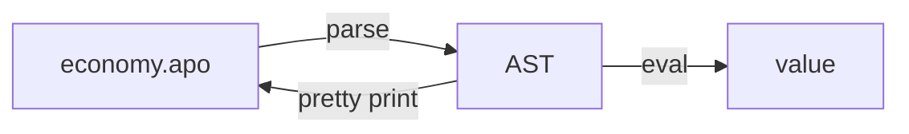

# Programming Languages 101

A famous functional programming language is ML (1973, evolved into SML and modern-day OCaml).
Our project of today is a tiny calculator language inspired by this family of languages.
The language has gotten the name ApoML, because it was Apostolis who kindly asked me to design
a training last minute and there was no time to think of something more clever.

ApoML is a small language to write down functions on integers.
It is intended to be used interactively. Consider the following computation:

```ocaml
(* ask for the initial values *)
let eu_interest  = ?(0,100) (* ask for input n s.t. 0 <= n <= 100 *) in
let loan         = ? in
let years        = ? in

(* compute what we need to pay back to the EU *)
loan * (100 + eu_interest) ^ years
```

Then you evaluate this computation interactively, like so:

```console
$ apo ./economy.apo
> enter a number between 0-100
< 10
> enter a number
< 400
> enter a number
< 5
-------------------------------
? * (100 + ?(0,100)) ^ ? = x
```

We want an implementation in Kotlin that reads the initial textual program and evaluates it.

## FP in Kotlin

The structure of such a language implementation resolves around the inductive definition
of its syntax. We like to write it down as a grammar:

```BNF
variables   x, y, z
integers    i, j = 0, 1, ...
expressions e   := x 
                | i 
                | ? 
                | ?(i, j) 
                | - e
                | e + e 
                | e * e 
                | let x = e in e
```

Programs are generated inductively from this grammar.
We can translate an inductive grammar to an algebraic datatype in Kotlin.

As a simple example, we can use the inductive definition of lists of some type `T`:

```BNF
elements of type T  x, y, z
lists of Ts         xs := [] | (x :: xs)
```

We translate this to an inductive datatype in Kotlin, like so:

```Kotlin
sealed interface List<T> {
    class Nil<T>: List<T>
    data class Cons<T>(val head: T, val tail: List<T>): List<T>
}
```

We can define functions on such inductive types by pattern matching and recursion,
like so:

```kotlin
fun <T> head(xs: List<T>): Option<T> = when (xs) {
    is Nil  -> none()
    is Cons -> Some(xs.head)
}
```

Kotlin is structurally almost identical to Java, but there are many surface-level
differences. The most important ones that you should be aware of for this project are:

### Expression Everywhere

A lot more language constructs in Kotlin than in Java are expressions rather than
statements. That means that they produce values. For example:

```kotlin
val theAnswer = if (condition) {
    42
} else 18
```

But also:

```kotlin
fun readOrElse(path: File, default: String): String = try {
    path.readText()
} catch (_: IOException) {
    default
}
```

### Extension methods

We can define a function like `head` in such a way that it is called as a method:

```kotlin
// head as an extension method; called as xs.head()
fun <T> List<T>.head(): Option<T> = when (this) {
    is Nil  -> none()
    is Cons -> Some(xs.head)
}
```

### Lambdas

We can write a function that receives a function as a parameter, like so:

```kotlin
fun <S, T> List<T>.map(f: (T) -> S): List<S> = when (this) {
    is Nil  -> Nil()
    is Cons -> Cons(f(head), tail.map(f))
}
```

When we call such a function, we can write the lambda like so:

```kotlin
Cons(1, Cons(2, Cons(3, Nil()))).map({ i -> i + 1 })
```

But we can omit the parens around the lambda when it is the last argument, writing instead:

```kotlin
Cons(1, Cons(2, Cons(3, Nil()))).map { i -> i + 1 }
```

And we can omit the name, when there is only 1, using `it` instead:

```kotlin
Cons(1, Cons(2, Cons(3, Nil()))).map { it + 1 }
```

## A Language Implementation Architecture

In these two days we want to roughly build the following language implementation:



The _parser_ takes text and outputs the abstract-syntax as defined inductively in Kotlin.
The interpreter then takes this abstract syntax and gives it meaning: the semantics of ApoML.

We will start things off with the parser today. If all goes well, we will look at the
interpreter tomorrow.

### Something to keep in mind

The architecture of a programming language is more broadly applicable.

We will see that the implementation of the interpreter most closely resembles what we tend
to give a lot of attention in imperative architectures: get the system to _do_ stuff.
The imperative nature becomes evident in the user interface of the software: press buttons do give instructions
to the system.

In such cases it is useful to remember this architecture and make space in the product for
a first class representation of 'what to do'. The counterpart of what is the AST in a language implementation.
Two examples from close to home:

Example 1: in True Code, users needed to define a test harness for their software before they could run a test.
This used to be implemented via a wizard that led them through these steps. Defining the harness, however,
took considerable effort. Using the 'give instructions to the system' interaction model it was difficult to
go back to a previous step to refine configurations over time. We redesigned this to a more declarative interaction
model: the user defines a configuration that specifies what the system should do from the outset. The configuration
is like the AST. The system can provide help in constructing the configuration, but that is phase-separated from the
evaluation of that configuration.

Example 2: in Inspector we are moving towards an operations frammework that closely resembles the architecture of
ApoML: we have an internal API for constructing an AST that specifies what the system should do. The AST (= operation
trees) are later interpreted by the system to make it act upon traces. We are still thinking about the nicest way to
construct those trees in python and Java. One should think about those 'model construction APIs' as the 'surface syntax'
of the operations framework. You could even think about actually adding a textual or graphical surface syntax for the
model in the future; to actually parse, or just to pretty print the model to the user.